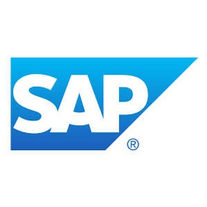

# Overview

This presentation promotes a new approach to documenting software. It's main focus is on microservices, but the pattern can be easily used to document monolith software.

## Conferences

This new approach was presented on the following conferences:
* [Cloudyna in Katowice, Poland in 2014](http://www.cloudyna.org/), [Video - in Polish](https://www.youtube.com/watch?v=F-1goNbdBkc)
* [Evolution of Technical Communication in Sofia, Bulgaria in 2015](http://etc-conference.eu/), no video recording.
* [Soap! in Cracow, Poland in 2015](http://soapconf.com/)
* [Gliwice Software BarCamp in Gliwice, Poland in 2015](http://www.meetup.com/Gliwice-Software-BarCamp/)

It was possible thanks to the company I work in that sponsored my travel each time. It is SAP.

# Promoted Technology

The most important piece of the whole new approach to independent documentation continuous delivery is based on:
* super cool tool created by [Benjamin Lupton](https://github.com/balupton). It is a static site generator (but not only!) called [DocPad](https://docpad.org/),
* amazing task runner http://gulpjs.com/

# Presentation Built With

I used awesome [reveal.js](http://lab.hakim.se/reveal-js/) built by [Hakim El Hattab](https://github.com/hakimel).

# License

MIT

If you want to present this topic on some conference or meetup, and you know how to do it, then I have nothing against it.
I just hope that this new approach will influence many people and change their approach to documentation creation process.
